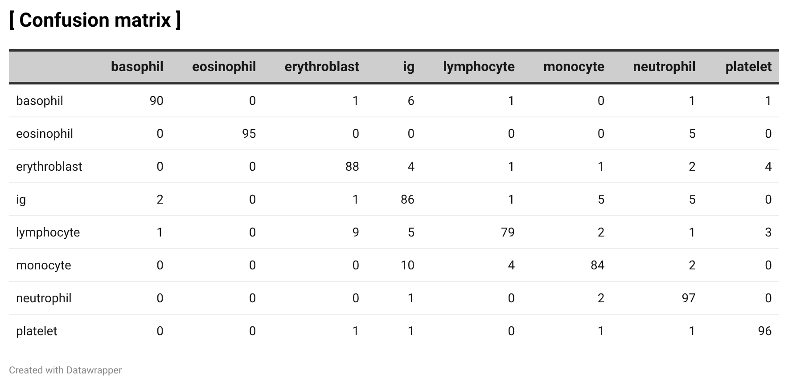

```md


# HemoCnn
A convolutional neural network trained using PyTorch to classify eight distinct blood cell subtypes with an accuracy of **89.38%**.

# **Description**

## **What it is**
A convolutional neural network trained using PyTorch capable of classifying eight distinct blood cell subtypes.  
The cell classes are:
Basophil, Eosinophil, Erythroblast, Immature Granulocyte (IG), Lymphocyte, Monocyte, Neutrophil, Platelet.

## **How it works**
The model is based on a **MobileNetV2** convolutional neural network trained using **transfer learning**.

Evaluation was performed on a balanced random subset of **800 images (100 per class)**.  
The model achieved:
- **Overall accuracy:** 89.38%
- **Macro-averaged F1-score:** 0.894

High performance was observed across most cell types, with particularly strong results for eosinophils, basophils, neutrophils, and platelets.  
Lower performance for immature granulocytes reflects known morphological similarities with neutrophils.

The confusion matrix indicates biologically plausible misclassifications.



## **Instructions**
1. **Download** `blood_cells_classifier.pth`
2. **Load the model in PyTorch**:

```python
from torchvision import models
import torch
import torch.nn as nn

model = models.mobilenet_v2(pretrained=False)
model.classifier[1] = nn.Linear(model.classifier[1].in_features, 8)
model.load_state_dict(torch.load("blood_cells_classifier.pth", weights_only=True))
model.eval()
